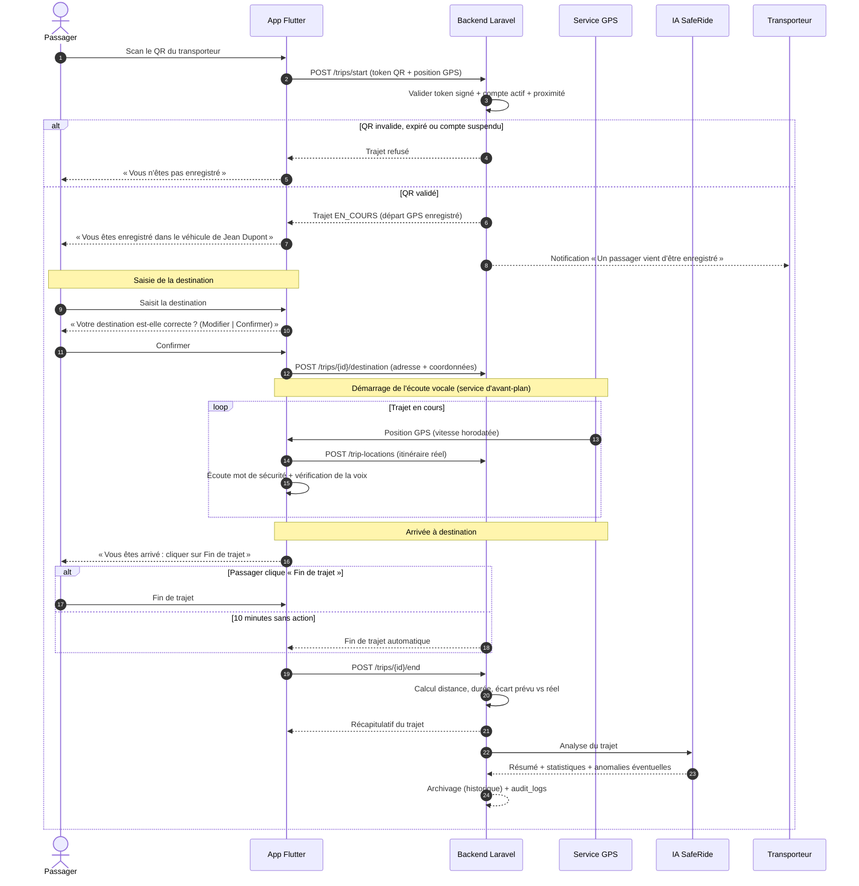
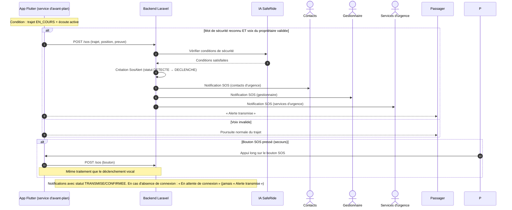

# SafeRide AI — Diagrammes UML

## Règles métier verrouillées

- L'écoute vocale démarre au lancement du trajet et s'arrête à la fin du trajet (active sur tous les trajets).
- Fin de trajet : le passager clique sur « Fin de trajet » ; sans action dans les 10 minutes après l'arrivée à destination, fin automatique.
- Le mot de sécurité est actif en permanence.
- Aucun paiement dans le périmètre.
- L'API d'identité (KYC) et l'IA SafeRide sont des services distincts.

## Diagramme de classes

```mermaid
classDiagram
  class User {
    +int id
    +string nom
    +string prenom
    +string email
    +string telephone
    +string password
    +string photo_url
    +enum statut : ACTIF|SUSPENDU|DESACTIVE
  }
  class Role {
    +int id
    +string nom
    +string slug
  }
  class Permission {
    +int id
    +string nom
    +string slug
  }
  class Vehicle {
    +int id
    +string marque
    +string modele
    +string immatriculation
    +enum type : MOTO|VOITURE|MINIBUS|BUS
    +enum statut : ACTIF|INACTIF
  }
  class QrCode {
    +int id
    +string token
    +bool actif
    +datetime expires_at
    +datetime last_used_at
  }
  class IdentityVerification {
    +int id
    +enum type : CNI|PASSEPORT|AUTRE
    +enum statut : EN_ATTENTE|VERIFIE|ECHOUE|A_EXAMINER
    +string provider_kyc
    +datetime verifie_le
  }
  class IdentityDocument {
    +int id
    +enum type : CNI|PASSEPORT|AUTRE
    +string numero
    +string fichier_url
    +json ocr_data
  }
  class EmergencyContact {
    +int id
    +string nom
    +string telephone
    +string relation
  }
  class VoiceSecurityProfile {
    +int id
    +string mot_securite
    +blob empreinte_vocale
    +bool actif
  }
  class Trip {
    +int id
    +decimal start_latitude
    +decimal start_longitude
    +decimal destination_latitude
    +decimal destination_longitude
    +string destination_address
    +datetime started_at
    +datetime ended_at
    +decimal distance_km
    +int duration_seconds
    +decimal deviation_km
    +enum statut : EN_COURS|TERMINE|ANNULE
    +enum end_method : MANUEL|AUTO_10MIN
  }
  class TripLocation {
    +int id
    +decimal latitude
    +decimal longitude
    +decimal vitesse_km_h
    +datetime captured_at
  }
  class LostItemReport {
    +int id
    +string objet
    +string description
    +enum statut : SIGNALE|EN_RECHERCHE|RETROUVE|RESTITUE|NON_RETROUVE|CLOTURE
  }
  class Dispute {
    +int id
    +string motif
    +string description
    +string decision
    +enum statut : OUVERT|EN_COURS|EN_ATTENTE|RESOLU|CLOTURE
  }
  class SosAlert {
    +int id
    +enum declenchement : VOCAL|BOUTON
    +decimal latitude
    +decimal longitude
    +datetime heure_detection
    +enum statut : DETECTE|VERIFICATION|DECLENCHE|NOTIFIE|EN_COURS|RESOLU|FAUSSE_ALERTE|CLOTURE
    +json details
  }
  class EmergencyService {
    +int id
    +string nom
    +string telephone
  }
  class SosEmergencyNotification {
    +int id
    +datetime notifie_le
    +enum statut : EN_ATTENTE|TRANSMISE|CONFIRMEE|ECHEC
  }
  class ManagerAssignment {
    +int id
    +enum dossier_type : OBJET_PERDU|LITIGE|SOS|IDENTITE
    +int dossier_id
    +enum statut : ATTRIBUE|PRIS_EN_CHARGE|CLOTURE
    +datetime assigned_at
    +datetime taken_at
    +datetime closed_at
  }
  class Notification {
    +int id
    +enum type : SOS|TRAJET|DOSSIER|IDENTITE|SYSTEME
    +string titre
    +string message
    +bool lu
  }
  class AuditLog {
    +int id
    +string action
    +string entity_type
    +int entity_id
    +json details
    +string ip
    +string user_agent
  }
  class AiReport {
    +int id
    +enum type : RESUME_TRAJET|STATISTIQUES|ANOMALIE|RECOMMANDATION
    +text contenu
    +string generateur
  }
  class AiInsight {
    +int id
    +string titre
    +string description
    +enum gravite : INFO|MOYENNE|ELEVEE
  }

  User "1" --> "*" Role : user_roles
  Role "*" --> "*" Permission : role_permissions
  User "1" --> "*" Vehicle : transporte
  User "1" --> "0..1" VoiceSecurityProfile
  User "1" --> "*" EmergencyContact
  User "1" --> "*" IdentityVerification
  User "1" --> "*" IdentityDocument
  IdentityVerification "1" --> "0..1" IdentityDocument : appuye
  Vehicle "1" --> "0..*" QrCode
  Vehicle "1" --> "1" User : transporteur
  User "1" --> "*" Trip : passager
  User "1" --> "*" Trip : transporteur
  Vehicle "1" --> "*" Trip
  Trip "1" --> "*" TripLocation : itineraire reel
  Trip "1" --> "0..*" LostItemReport
  Trip "1" --> "0..*" Dispute
  Trip "1" --> "0..*" SosAlert
  User "1" --> "*" SosAlert : passager
  SosAlert "1" --> "*" SosEmergencyNotification
  EmergencyService "1" --> "*" SosEmergencyNotification
  User "1" --> "*" ManagerAssignment : gestionnaire
  User "1" --> "*" Notification
  User "1" --> "*" AuditLog
  AiReport "1" --> "*" AiInsight
  Trip "0..1" --> "0..*" AiReport
  User "0..1" --> "0..*" AiReport
```

## Diagramme de séquence — Trajet complet

## Diagramme de séquence — Déclenchement SOS

## Statuts des dossiers

| Dossier | Statuts |
|---|---|
| Objet perdu | SIGNALE → EN_RECHERCHE → RETROUVÉ | RESTITUÉ | NON_RETROUVÉ → CLÔTURÉ |
| Litige | OUVERT → EN_COURS | EN_ATTENTE → RÉSOLU → CLÔTURÉ |
| SOS | DÉTECTÉ → VÉRIFICATION → DÉCLENCHÉ → NOTIFIÉ → EN_COURS → RÉSOLU | FAUSSE_ALERTE → CLÔTÉ |
| Identité | EN_ATTENTE → VÉRIFIÉ | ÉCHOUÉ | À_EXAMINER |

## Attribution des gestionnaires

- Tout dossier (objet perdu, litige, SOS, identité à examiner) est attribué automatiquement à un gestionnaire disponible via `manager_assignments`.
- L'administrateur peut mesurer le nombre de dossiers traités par gestionnaire.

## Fonctionnalités futures (hors périmètre)

- Paiement (exclu même en perspective).
- Notation du transporteur / du trajet après la fin du trajet (table `ratings`).
- QR dynamique / renouvelé et détection de position incohérente (anti faux trajet avancé).