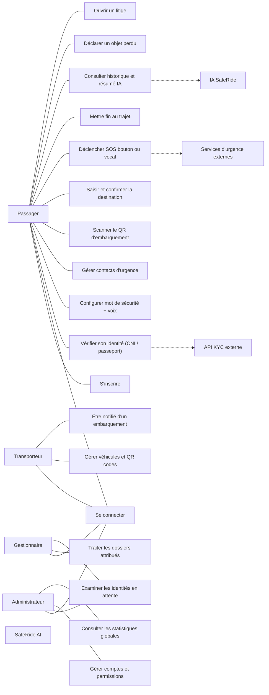
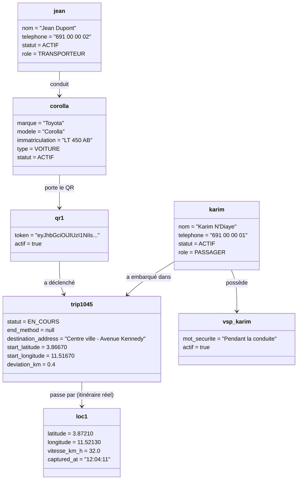
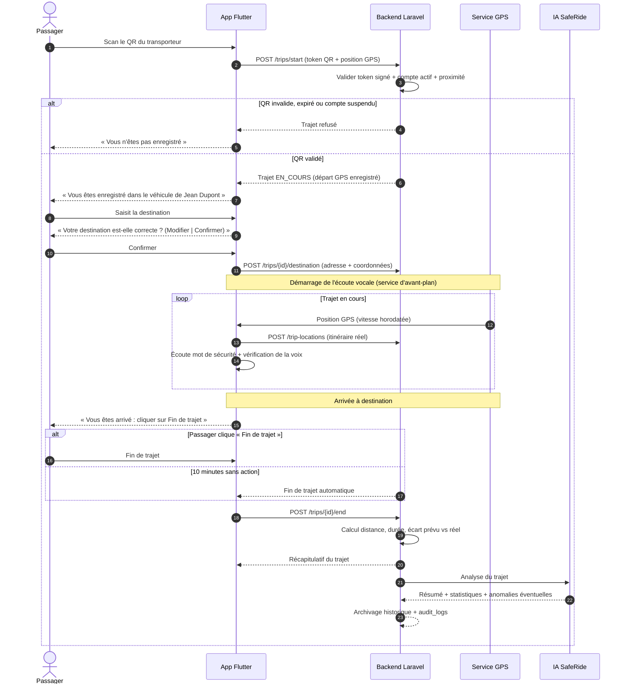
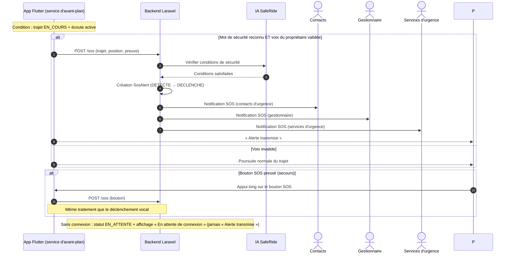
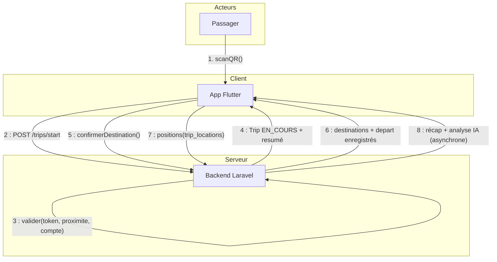
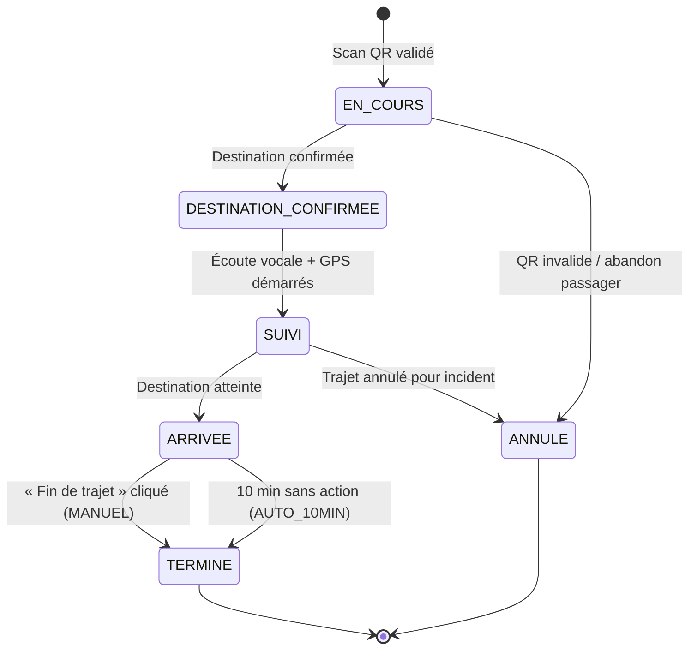
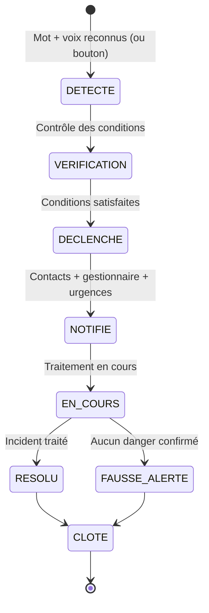
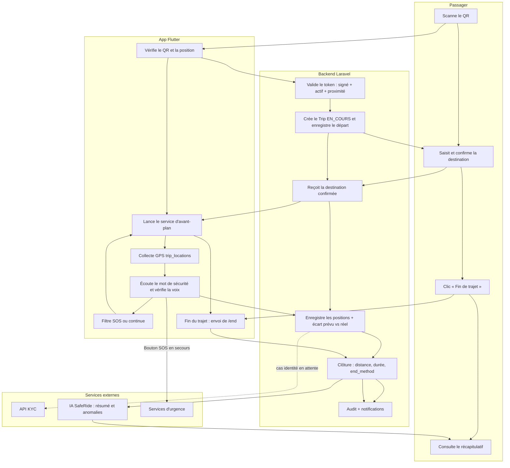
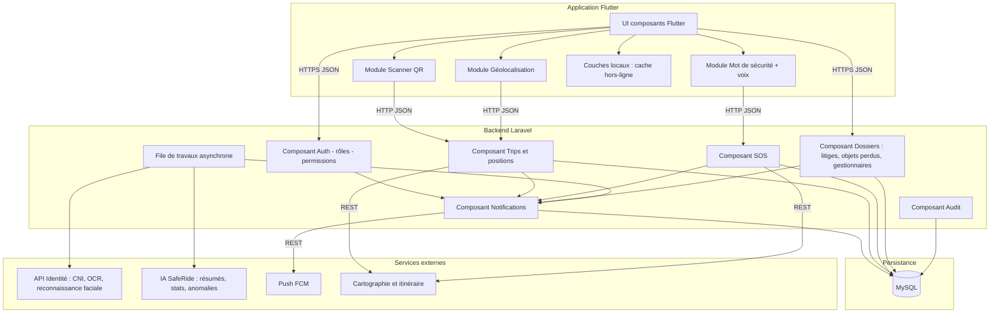

# SafeRide AI — Les 9 diagrammes UML principaux

Diagrammes couverts :
1. Diagramme de cas d'utilisation
2. Diagramme de classes
3. Diagramme d'objets
4. Diagramme de séquence
5. Diagramme de communication
6. Diagramme d'états (state chart)
7. Diagramme d'activité
8. Diagramme de composants
9. Diagramme de déploiement

> Note : Mermaid ne possède pas de formes natives « cas d'utilisation », « objets » et « communication ».
> Ils sont donc représentés de façon fidèle avec des variantes proches (graph/class). Ils sont prêts à être
> retranscrits tels quels dans StarUML, draw.io ou PlantUML pour la version soutenance.

---

## 1. Diagramme de cas d'utilisation



Acteurs : `Passager`, `Transporteur`, `Gestionnaire`, `Administrateur` + systèmes externes (`API KYC`, `IA SafeRide`, `Services d'urgence`).

---

## 2. Diagramme de classes

```mermaid
classDiagram
  class User {
    +int id
    +string nom
    +string prenom
    +string email
    +string telephone
    +string password
    +string photo_url
    +enum statut : ACTIF|SUSPENDU|DESACTIVE
  }
  class Role {
    +int id
    +string nom
    +string slug
  }
  class Permission {
    +int id
    +string nom
    +string slug
  }
  class Vehicle {
    +int id
    +string marque
    +string modele
    +string immatriculation
    +enum type : MOTO|VOITURE|MINIBUS|BUS
    +enum statut : ACTIF|INACTIF
  }
  class QrCode {
    +int id
    +string token
    +bool actif
    +datetime expires_at
    +datetime last_used_at
  }
  class IdentityVerification {
    +int id
    +enum type : CNI|PASSEPORT|AUTRE
    +enum statut : EN_ATTENTE|VERIFIE|ECHOUE|A_EXAMINER
    +string provider_kyc
    +datetime verifie_le
  }
  class IdentityDocument {
    +int id
    +enum type : CNI|PASSEPORT|AUTRE
    +string numero
    +string fichier_url
    +json ocr_data
  }
  class EmergencyContact {
    +int id
    +string nom
    +string telephone
    +string relation
  }
  class VoiceSecurityProfile {
    +int id
    +string mot_securite
    +blob empreinte_vocale
    +bool actif
  }
  class Trip {
    +int id
    +decimal start_latitude
    +decimal start_longitude
    +decimal destination_latitude
    +decimal destination_longitude
    +string destination_address
    +datetime started_at
    +datetime ended_at
    +decimal distance_km
    +int duration_seconds
    +decimal deviation_km
    +enum statut : EN_COURS|TERMINE|ANNULE
    +enum end_method : MANUEL|AUTO_10MIN
  }
  class TripLocation {
    +int id
    +decimal latitude
    +decimal longitude
    +decimal vitesse_km_h
    +datetime captured_at
  }
  class LostItemReport {
    +int id
    +string objet
    +string description
    +enum statut : SIGNALE|EN_RECHERCHE|RETROUVE|RESTITUE|NON_RETROUVE|CLOTURE
  }
  class Dispute {
    +int id
    +string motif
    +string description
    +string decision
    +enum statut : OUVERT|EN_COURS|EN_ATTENTE|RESOLU|CLOTURE
  }
  class SosAlert {
    +int id
    +enum declenchement : VOCAL|BOUTON
    +decimal latitude
    +decimal longitude
    +datetime heure_detection
    +enum statut : DETECTE|VERIFICATION|DECLENCHE|NOTIFIE|EN_COURS|RESOLU|FAUSSE_ALERTE|CLOTE
    +json details
  }
  class EmergencyService {
    +int id
    +string nom
    +string telephone
  }
  class SosEmergencyNotification {
    +int id
    +datetime notifie_le
    +enum statut : EN_ATTENTE|TRANSMISE|CONFIRMEE|ECHEC
  }
  class ManagerAssignment {
    +int id
    +enum dossier_type : OBJET_PERDU|LITIGE|SOS|IDENTITE
    +int dossier_id
    +enum statut : ATTRIBUE|PRIS_EN_CHARGE|CLOTURE
    +datetime assigned_at
    +datetime taken_at
    +datetime closed_at
  }
  class Notification {
    +int id
    +enum type : SOS|TRAJET|DOSSIER|IDENTITE|SYSTEME
    +string titre
    +string message
    +bool lu
  }
  class AuditLog {
    +int id
    +string action
    +string entity_type
    +int entity_id
    +json details
    +string ip
    +string user_agent
  }
  class AiReport {
    +int id
    +enum type : RESUME_TRAJET|STATISTIQUES|ANOMALIE|RECOMMANDATION
    +text contenu
    +string generateur
  }
  class AiInsight {
    +int id
    +string titre
    +string description
    +enum gravite : INFO|MOYENNE|ELEVEE
  }

  User "1" --> "*" Role : user_roles
  Role "*" --> "*" Permission : role_permissions
  User "1" --> "*" Vehicle : transporte
  User "1" --> "0..1" VoiceSecurityProfile
  User "1" --> "*" EmergencyContact
  User "1" --> "*" IdentityVerification
  User "1" --> "*" IdentityDocument
  IdentityVerification "1" --> "0..1" IdentityDocument : appuye
  Vehicle "1" --> "0..*" QrCode
  Vehicle "1" --> "1" User : transporteur
  User "1" --> "*" Trip : passager
  User "1" --> "*" Trip : transporteur
  Vehicle "1" --> "*" Trip
  Trip "1" --> "*" TripLocation : itineraire reel
  Trip "1" --> "0..*" LostItemReport
  Trip "1" --> "0..*" Dispute
  Trip "1" --> "0..*" SosAlert
  User "1" --> "*" SosAlert : passager
  SosAlert "1" --> "*" SosEmergencyNotification
  EmergencyService "1" --> "*" SosEmergencyNotification
  User "1" --> "*" ManagerAssignment : gestionnaire
  User "1" --> "*" Notification
  User "1" --> "*" AuditLog
  AiReport "1" --> "*" AiInsight
  Trip "0..1" --> "0..*" AiReport
  User "0..1" --> "0..*" AiReport
```



---

## 3. Diagramme d'objets (instanciation)

Instances à un instant donné : le trajet T-1045 est EN_COURS, surveillé vocalement.



---

## 4. Diagramme de séquence — Trajet complet (scénario principal)



## Diagramme de séquence — Déclenchement SOS (scénario secondaire)



---

## 5. Diagramme de communication — Démarrage d'un trajet

Mêmes échanges que la séquence, numérotés dans l'ordre.



---

## 6. Diagramme d'états

### État du trajet (Trip)



### État d'une alerte SOS (SosAlert)



---

## 7. Diagramme d'activité — Trajet avec surveillance vocale

Couloirs : Passager / App / Backend / Services externes.



---

## 8. Diagramme de composants



---

## 9. Diagramme de déploiement

```mermaid
flowchart TB
  subgraph MOBILE[Noeud : Téléphone de l'utilisateur]
    APP[App Flutter - Android]
    STORAGE[Stockage local : cache GPS, alerte SOS en attente]
  end

  subgraph SERVEUR_APP[Noeud : Serveur applicatif]
    NGINX[Conteneur Nginx]
    PHP[Conteneur PHP-FPM : Laravel API]
    QUEUE[Conteneur worker files]
  end

  subgraph SERVEUR_DB[Noeud : Serveur base de données]
    MYSQL[(MySQL 8)]
  end

  subgraph CLOUD[Provisions externes]
    KC[API KYC]
    SR[IA SafeRide]
    FCM[Notifications FCM]
    MC[Cartographie]
  end

  APP -- HTTPS 443 --> NGINX
  APP --> STORAGE
  NGINX --> PHP
  PHP --> MYSQL : MySQL 3306
  PHP --> QUEUE
  QUEUE -- REST --> KC
  QUEUE -- REST --> SR
  PHP -- REST --> FCM
  APP -- REST --> MC
  PHP -- REST --> MC
```